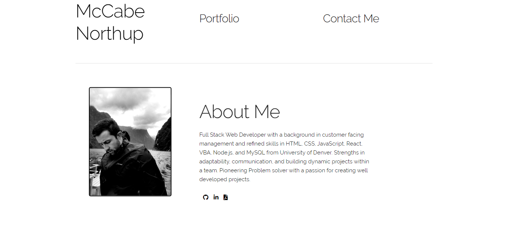

# McCabe Northup Portfolio

Dear Hiring Manager,
I have currently graduated from Denver University with a certification in Full Web Stack Development and an emphasis in the MERN Stack. With this I have a solid understanding of MongoDB, ExpressJS, ReactJS, and NodeJS. This of course also includes an overall well-defined understanding of HTML, CSS frameworks, databases, MySQL, MVC, and JavaScript.    
I also would be adding to your organization a wealth of knowledge in group collaboration. I have a robust GitHub account with over 450 commits and several group collaborations. I have been an instrumental part in several dynamic CRUD, interactive projects. 
I would like to speak further about the current open position within your organization. I believe that I will not only be a great fit into your culture, but an asset to your team. 
I have also attached my personal the link to my personal portfolio, GitHub, and LinkedIn accounts. 

Sincerely,
McCabe Northup

## Link to Deployed Product
https://mccabenorthup.herokuapp.com/