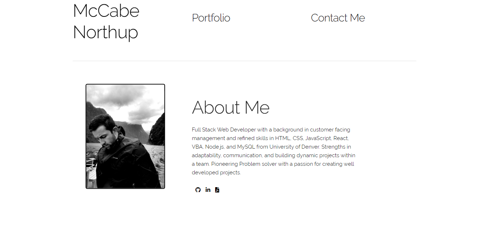

# portfolio2.0

# portfolio

## Function 
The function of my portfolio is to display my knowledge in  full stack web development, such as: HTML, CSS, JavaScript, JQuery, Server Side API's. The end user being a future employer or client.   

## Link to Deployed Product
https://mnorthup2207.github.io/portfolio2.0/